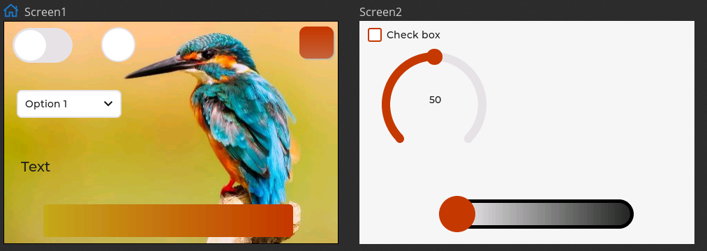

# SC01_Plus_HMI_example
Example using SquareLine Studio to make an HMI with an SC01_plus capacitive display. 

Included, the custom SC01_plus config file for SquareLine Studio.

Arduino example :  
`SC01PLUS_kingfisher_example`

[Custom SquareLine Board Config file](https://docs.squareline.io/docs/obp/) to put in \SquareLine Studio 1.1.1\boards\espressif :   
`SC01_PLUS`

SquareLine project :  
`SquareLine_kingfisher_example  `

Configuration header file for LVGL :  
`lv_conf.h`

***

HMI looks like this:

